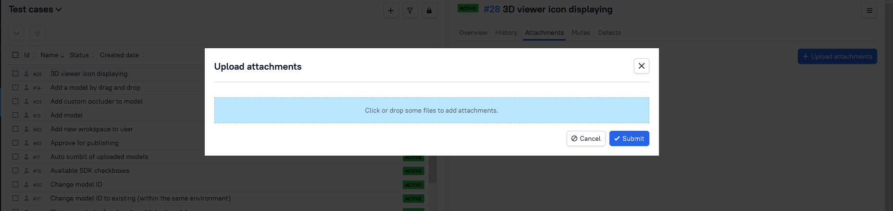

# Allure_TestOps_StoredXss
Allure TestOps Stored XSS vulnerability

# Reproduce

- Go to projects

- Then, click on a project or create one

- Click on the test cases

- Choose a test case then, attachment tab

