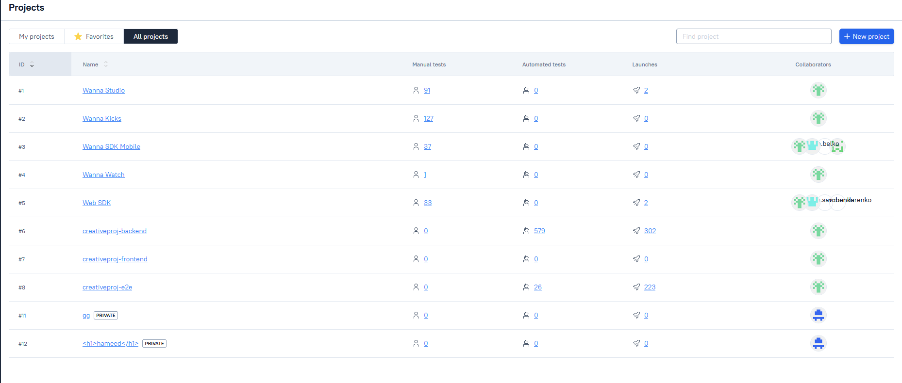
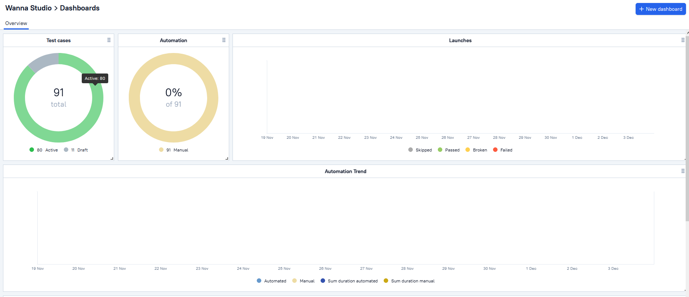
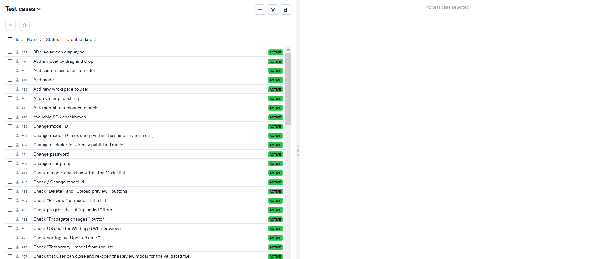
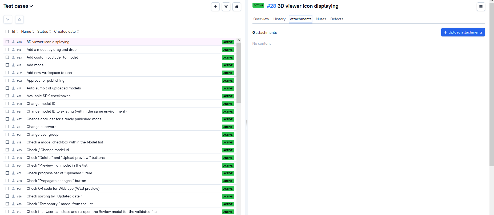
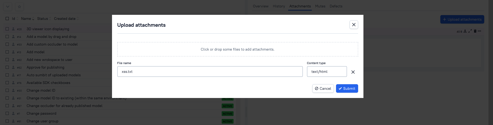
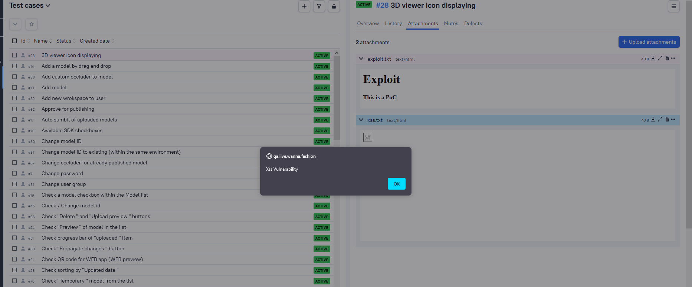

# Allure_TestOps_StoredXss
Allure TestOps Stored XSS vulnerability

# Reproduce

- Create a exploit.txt file that contains a js code

- Go to projects

- Then, click on a project or create one

- Click on the test cases

- Choose a test case then, attachment tab

- Click upload and upload your file

# PoC

# By
<a href="https://www.linkedin.com/in/ahmed-abdulhameed-729737158/">Hameed74</a> & <a href="https://www.linkedin.com/in/zer0verflow/">Zeyad Azima</a>
  
